# RideLink - Backend Microservices for a Ride-Sharing Platform

RideLink is a backend microservices solution for a fictional ride-sharing platform developed with **Java Spring Boot 3/4** and **MongoDB**, featuring full role-based security (JWT), OpenAPI/Swagger UI specifications, repeatable Postman suites, and Continuous Integration (CI).

---

## 1. Team & Microservice Ownership

| # | Microservice | Primary Owner | Port | Database (MongoDB) | Minimum Responsibility |
|---|---|---|---|---|---|
| **1** | **Account Service** | Member 1 | `8081` | `ridelink_account` | Passenger & driver registration; login and token issuance (JWT); role management; profile viewing/updating; status management. |
| **2** | **Driver & Vehicle Service** | Member 2 | `8082` | `ridelink_driver` | Driver operational profile; vehicle details; availability status; service area; simulated location; retrieval of eligible available drivers. |
| **3** | **Ride Management Service** | Member 3 | `8083` | `ridelink_ride` | Ride request creation; pickup/destination; driver assignment; ride status lifecycle (requested, assigned, accepted, in-progress, completed, cancelled); ride retrieval. |
| **4** | **Fare & Payment Service** | Member 4 | `8084` | `ridelink_fare` | Fare estimation; final fare calculation using documented rule (`FARE-RULE-V1`); simulated payment recording; payment status; receipt generation & retrieval. |

---

## 2. Architecture & Data Ownership

```
                       +---------------------------------------+
                       |             Client / Swagger          |
                       |       (Postman Test Collection)       |
                       +---------------------------------------+
                           |              |           |
                           | (Port 8081)  |           | (Port 8084)
                           v              |           v
                  +-----------------+     |    +------------------------+
                  | Account Service |     |    | Fare & Payment Service |
                  |   (Port 8081)   |     |    |      (Port 8084)       |
                  +-----------------+     |    +------------------------+
                           |              |           ^          ^
                    [ridelink_account]    |           |          |
                                          |           |          |
                                          v           | (Sync REST)
                               +------------------------+        |
                               | Ride Management Service|--------+
                               |      (Port 8083)       |
                               +------------------------+
                                          |           ^
                                          | (Sync REST)
                                          v           |
                               +------------------------+
                               | Driver & Vehicle Serv. |
                               |      (Port 8082)       |
                               +------------------------+
                                          |
                                   [ridelink_driver]
```

### 2.1 Persistence Boundaries
In adherence to microservices architecture, each service strictly maintains its own database schema boundary:
- **`ridelink_account`**: Managed solely by `account-service`. Holds user credentials (BCrypt hashed), profiles, roles.
- **`ridelink_driver`**: Managed solely by `driver-vehicle-service`. Holds operational driver profiles, vehicle specs, availability flags, and GPS coordinates.
- **`ridelink_ride`**: Managed solely by `ride-management-service`. Holds ride lifecycle records, timestamps, assigned drivers, and financial references.
- **`ridelink_fare`**: Managed solely by `fare-payment-service`. Holds immutable fare quotes, payment receipts, and transaction records.

*No cross-service direct database queries exist.* Services communicate strictly via REST contracts using stable identifiers (`accountId`, `rideId`).

---

## 3. End-to-End Sequence Diagram

```mermaid
sequenceDiagram
    autonumber
    actor Passenger
    actor Driver
    participant Account as Account Service (8081)
    participant DriverSvc as Driver Service (8082)
    participant FareSvc as Fare Service (8084)
    participant RideSvc as Ride Service (8083)

    Passenger->>Account: POST /api/auth/login
    Account-->>Passenger: JWT Token (Role: PASSENGER)
    Driver->>Account: POST /api/auth/login
    Account-->>Driver: JWT Token (Role: DRIVER)

    Driver->>DriverSvc: PUT /api/drivers/me (Availability=true, Location)
    DriverSvc-->>Driver: 200 OK (Driver Available)

    Passenger->>RideSvc: POST /api/rides (Pickup, Destination, ServiceArea)
    Note over RideSvc: Status: REQUESTED
    RideSvc->>FareSvc: POST /api/fares/estimate
    FareSvc-->>RideSvc: Fare Estimate (Distance, Duration, LKR)
    RideSvc->>DriverSvc: GET /api/drivers/available?serviceArea=...
    DriverSvc-->>RideSvc: Eligible Drivers List
    RideSvc->>DriverSvc: PATCH /api/drivers/{driverId}/availability (available=false)
    Note over RideSvc: Driver Assigned -> Status: ASSIGNED
    RideSvc-->>Passenger: 201 Created (Ride assigned to Driver)

    Driver->>RideSvc: PATCH /api/rides/{rideId}/accept
    Note over RideSvc: Status: ACCEPTED
    Driver->>RideSvc: PATCH /api/rides/{rideId}/start
    Note over RideSvc: Status: IN_PROGRESS
    Driver->>RideSvc: PATCH /api/rides/{rideId}/complete
    Note over RideSvc: Status: COMPLETED
    RideSvc->>FareSvc: POST /api/fares/calculate
    FareSvc-->>RideSvc: Final Fare Quote
    RideSvc->>DriverSvc: PATCH /api/drivers/{driverId}/availability (available=true)
    RideSvc-->>Driver: 200 OK (Ride Completed)

    Passenger->>RideSvc: POST /api/rides/{rideId}/pay (Method: CARD)
    RideSvc->>FareSvc: POST /api/payments
    FareSvc-->>RideSvc: Payment Status: COMPLETED, Receipt: RCP-XXXX
    RideSvc-->>Passenger: 200 OK (Paid with Receipt)
```



---

## 4. Interservice Communication Justification

### Selected Approach: Synchronous REST with Internal API Key & Bearer Tokens
- **Why REST for Ride Assignment & Fares?**
  1. **Immediate Consistency:** Ride creation and driver assignment require real-time feedback to passengers. Immediate confirmation that a driver is nearby and fares are known provides immediate transactional integrity.
  2. **Coupling Control:** Interservice calls are guarded by an internal service token (`X-Internal-Api-Key: local-dev-internal-key`) and mapped to `ROLE_SERVICE`.
  3. **Fallbacks:** In `RideService`, if Fare Service is temporarily unavailable during request creation, the ride is still safely recorded in `REQUESTED` state without crashing.
- **Comparison with Asynchronous Messaging (RabbitMQ/Kafka):**
  - While message queues allow high throughput and buffering during driver load spikes, they introduce eventual consistency where the passenger must poll for driver assignment. Synchronous REST keeps the request lifecycle intuitive for demonstration and validation.

---

## 5. Security & Secret Handling
- **JWT Authentication:** JJWT (0.12.6) with HMAC-SHA256 signatures (`ridelink.security.jwt-secret`).
- **Role-Based Access Control (RBAC):**
  - `ROLE_PASSENGER`: Ride request creation, payment, viewing own history.
  - `ROLE_DRIVER`: Operational profile update, vehicle update, location update, accept/start/complete assigned rides.
  - `ROLE_ADMIN`: Global ride overview, account activation/suspension, manual assignment.
  - `ROLE_SERVICE`: Internal microservice-to-microservice updates.
- **No Committed Secrets:** Secrets are externalized to environment variables (`JWT_SECRET`, `INTERNAL_API_KEY`, `MONGODB_URI`).

---

## 6. Seed Credentials & Test Data

Demo data is automatically seeded on startup (`ridelink.seed-demo-data=true`):

| Role | Email | Password | Account ID |
|---|---|---|---|
| **ADMIN** | `admin@ridelink.local` | `Password123!` | `acc-admin-001` |
| **PASSENGER** | `passenger@ridelink.local` | `Password123!` | `acc-passenger-001` |
| **DRIVER** | `driver@ridelink.local` | `Password123!` | `acc-driver-001` |

---

## 7. Startup & Execution Instructions

### Prerequisites
- **Java SE Development Kit (JDK 17)**
- **MongoDB** running locally on port `27017` (e.g., standard MongoDB Community Server or MongoDB Atlas URI)

### Recommended Start-up Order
Start each microservice in a dedicated terminal window:

```bash
# Terminal 1: Account Service (Port 8081)
cd account-service
./mvnw spring-boot:run

# Terminal 2: Driver & Vehicle Service (Port 8082)
cd driver-vehicle-service
./mvnw spring-boot:run

# Terminal 3: Fare & Payment Service (Port 8084)
cd fare-payment-service
./mvnw spring-boot:run

# Terminal 4: Ride Management Service (Port 8083)
cd ride-management-service
./mvnw spring-boot:run
```

*(On Windows PowerShell, use `.\mvnw.cmd spring-boot:run`)*

---

## 8. Swagger UI / OpenAPI Endpoints

| Service | Swagger UI URL | OpenAPI JSON Specification |
|---|---|---|
| **Account Service** | [http://localhost:8081/swagger-ui.html](http://localhost:8081/swagger-ui.html) | [http://localhost:8081/v3/api-docs](http://localhost:8081/v3/api-docs) |
| **Driver & Vehicle Service** | [http://localhost:8082/swagger-ui.html](http://localhost:8082/swagger-ui.html) | [http://localhost:8082/v3/api-docs](http://localhost:8082/v3/api-docs) |
| **Ride Management Service** | [http://localhost:8083/swagger-ui.html](http://localhost:8083/swagger-ui.html) | [http://localhost:8083/v3/api-docs](http://localhost:8083/v3/api-docs) |
| **Fare & Payment Service** | [http://localhost:8084/swagger-ui.html](http://localhost:8084/swagger-ui.html) | [http://localhost:8084/v3/api-docs](http://localhost:8084/v3/api-docs) |

---

## 9. Running Tests

Each microservice contains dedicated unit test suites covering both normal workflows and negative/edge cases:

```bash
# Run tests for Account Service
cd account-service && ./mvnw test

# Run tests for Driver Service
cd driver-vehicle-service && ./mvnw test

# Run tests for Fare & Payment Service
cd fare-payment-service && ./mvnw test

# Run tests for Ride Management Service
cd ride-management-service && ./mvnw test
```

---

## 10. Postman Testing Guide

1. Open Postman.
2. Import `postman/RideLink.postman_environment.json`.
3. Import `postman/RideLink.postman_collection.json`.
4. Select the **RideLink Local Environment**.
5. Execute requests sequentially:
   - **1. Account Service**: Log in to retrieve and automatically set `adminToken`, `passengerToken`, `driverToken`.
   - **2. Driver Service**: Verify profile setup, vehicle updates, location, and driver availability.
   - **3. Fare Service**: Verify fare estimates, final calculations, and direct receipt retrieval.
   - **4. Ride Management Workflow**: Run the full lifecycle: Request Ride &rarr; Accept &rarr; Start &rarr; Complete &rarr; Pay.
   - **5. Negative & Failure Scenarios**: Verify negative cases (invalid logins, forbidden role actions, invalid lifecycle transitions, and failed payments).
